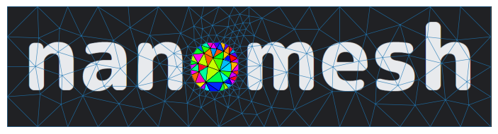

[](https://nanomesh.readthedocs.io/en/latest/?badge=latest)
[](https://github.com/hpgem/nanomesh/actions/workflows/test.yaml)
[](https://pypi.org/project/nanomesh/)
[](https://pypi.org/project/nanomesh/)



# nanomesh

Creates 3d meshes from microscopy experimental data.

Documentation: https://nanomesh.readthedocs.io/en/latest/

## Installation

If you use conda, create a new environment:

```
conda create -n nanomesh python=3.9
conda activate nanomesh
```

Install nanomesh:

```
pip install nanomesh
```

For the full installation instructions, see the [documentation](https://nanomesh.readthedocs.io/en/latest/).

### Development

Install `nanomesh` using the development dependencies:

`pip install -e .[develop] -c constraints.txt`

Running the tests:

`pytest`

Linting/checks:

`pre-commit`

Building the docs:

```
make html --directory docs
```
