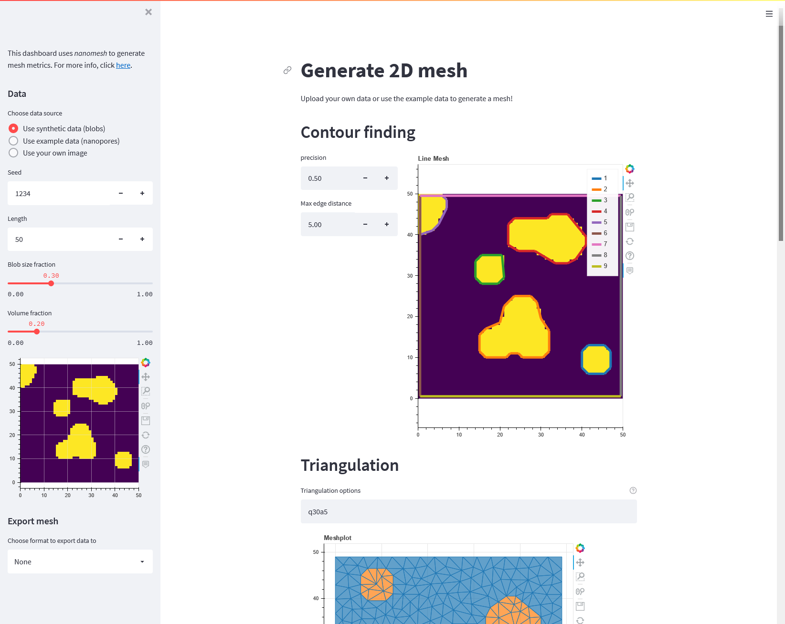
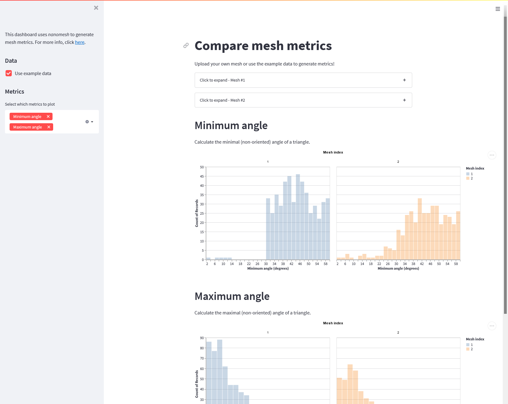
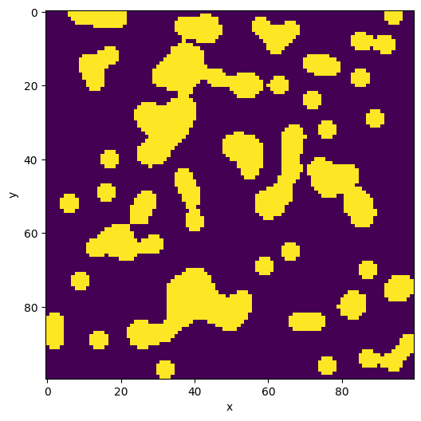
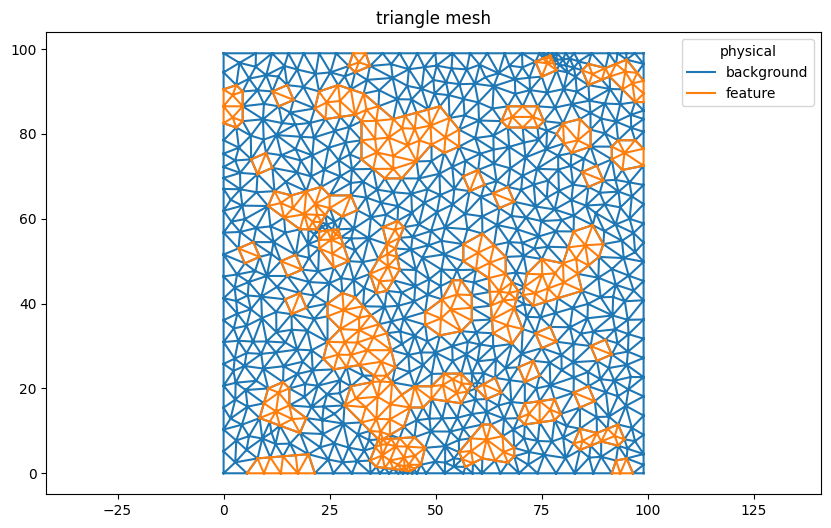

[](https://nanomesh.readthedocs.io/en/latest/?badge=latest)
[](https://github.com/hpgem/nanomesh/actions/workflows/test.yaml)
[](https://pypi.org/project/nanomesh/)
[](https://pypi.org/project/nanomesh/)
[](https://zenodo.org/badge/latestdoi/311460276)


# Nanomesh

Nanomesh is a Python workflow tool for generating meshes from 2D and 3D image data. It has an easy-to-use API that can help process and segment image data, generate quality meshes (triangle / tetrahedra), and write the data to many mesh formats. Nanomesh also contains tools to inspect the meshes, visualize them, and generate cell quality metrics.

- Easy-to-use Python API
- Segment and mesh 2D or 3D image data
- Mesh visualization
- Calculate and plot cell metrics
- Export to many mesh formats

Documentation: https://nanomesh.readthedocs.io/en/latest/

## Try nanomesh in your browser!

| <a href="https://share.streamlit.io/hpgem/nanomesh-dashboard/master/meshing_dash.py"></a> | <a href="https://share.streamlit.io/hpgem/nanomesh-dashboard/master/metrics_dash.py"></a> |
| - | - |
| [Generate a 2D mesh](https://share.streamlit.io/hpgem/nanomesh-dashboard/master/meshing_dash.py) | [Calculate mesh metrics](https://share.streamlit.io/hpgem/nanomesh-dashboard/master/metrics_dash.py) |

## Show me an example!

This example shows the workflow for generating a mesh from segmented data, and demonstrates a few of the features of Nanomesh. It uses a synthetic binary image with several rounded blob-like objects generated by [skimage](https://scikit-image.org/).

```pycon
>>> from skimage.data import binary_blobs
>>> from nanomesh import Image
>>>
>>> blobs = binary_blobs(length=100, volume_fraction=0.25, seed=2102)
>>> plane = Image(blobs)
>>>
>>> print(plane)
Plane(shape=(100, 100), range=(False,True), dtype=bool)
```

[`Image`](https://nanomesh.readthedocs.io/en/latest/api.image_data.html#nanomesh.Image) is essentially a container for a [`numpy`](https://numpy.org/) array with some methods for image segmentation and visualization.

```pycon
>>> plane.show()
<AxesSubplot:xlabel='x', ylabel='y'>
```



Generating a mesh from image data is simple in Nanomesh using [`Plane.generate_mesh()`](https://nanomesh.readthedocs.io/en/latest/api.meshing.html#nanomesh.plane2mesh). The options `opts` are passed to the triangulation function ([`nanomesh.triangulate`](https://nanomesh.readthedocs.io/en/latest/api.helpers.html#nanomesh.triangulate)). In this example, we use `q30` to generate a quality mesh with minimum angles of 30°, and `a50` to limit the triangle size to 50 pixels.

The returned `mesh` is a [`MeshContainer`](https://nanomesh.readthedocs.io/en/latest/api.mesh_data.html#nanomesh.MeshContainer) that contains the generated triangles and line segments.

```pycon
>>> mesh = plane.generate_mesh(opts='q30a10')
>>> mesh
<MeshContainer>
  Number of points: 932
  Number of cells:
    triangle: 1754
    line: 2685
  Point data: physical
  Cell data: physical
  Field data: feature, background
```

In the next cell, we plot the triangles.

```pycon
>>> mesh.plot('triangle')
<AxesSubplot:title={'center':'triangle mesh'}>
```



With the [metrics submodule](https://nanomesh.readthedocs.io/en/latest/api.metrics.html), Nanomesh can also calculate cell quality metrics and show them as a [colored triangle](https://nanomesh.readthedocs.io/en/latest/api.metrics.html#nanomesh.metrics.plot2d) or [histogram plot](https://nanomesh.readthedocs.io/en/latest/api.metrics.html#nanomesh.metrics.histogram).

```pycon
>>> from nanomesh import metrics
>>> triangle_mesh = mesh.get('triangle')
>>> metrics.histogram(triangle_mesh, metric='radius_ratio')
<AxesSubplot:title={'center':'Histogram of radius ratio'}, xlabel='Radius ratio', ylabel='frequency'>
```


Nanomesh uses [meshio](https://github.com/nschloe/meshio) to write data to most meshing formats.

```pycon
>>> mesh.write('mesh.vtk')
Warning: VTK requires 3D points, but 2D points given. Appending 0 third component.
```

That's it! There is a lot more that Nanomesh can do, check out [the examples](https://nanomesh.readthedocs.io/en/latest/examples/index.html) for an overview.

## Installation

One of the goals for Nanomesh is that it is easy to install.
This means that all dependencies are available from [PyPi](https://pypi.org).

If you use conda, it is advised to create a new environment:

```
conda create -n nanomesh python=3.9
conda activate nanomesh
```

Install nanomesh:

```
pip install nanomesh
```

For the full installation instructions, see the [installation guidelines](https://nanomesh.readthedocs.io/en/latest/install.html).

## Development

Check out our [Contributing Guidelines](CONTRIBUTING.md#Getting-started-with-develoment) to get started with development.
