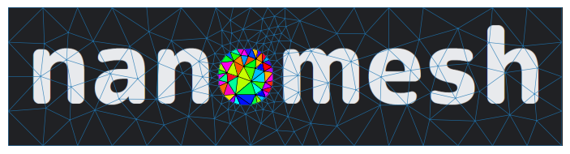

.. nanomesh documentation master file, created by
   sphinx-quickstart on Thu Jun 21 11:07:11 2018.
   You can adapt this file completely to your liking, but it should at least
   contain the root `toctree` directive.

|Documentation Status| |tests| |PyPI - Python Version| |PyPI|

Welcome to the nanomesh documentation!

Nanomesh is a python workflow tool for generating meshes from 2D and 3D microscopy image data.

.. toctree::
   :maxdepth: 2
   :caption: Getting Started

   install
   development

.. toctree::
   :maxdepth: 2
   :caption: Examples
   :glob:

   examples/*

.. toctree::
   :maxdepth: 2
   :caption: API

   api.rst

.. toctree::
   :caption: Links

   👨‍💻 Source code <https://github.com/HPGEM/nanomesh>
   💡 Issues <https://github.com/HPGEM/nanomesh/issues>
   📢 Releases <https://github.com/hpgem/nanomesh/releases>
   🐍 PyPI <https://pypi.org/project/nanomesh>
   📚 documentation <https://nanomesh.readthedocs.io>

Indices and tables
==================

* :ref:`genindex`
* :ref:`modindex`
* :ref:`search`

.. |Documentation Status| image:: https://readthedocs.org/projects/nanomesh/badge/?version=latest
   :target: https://nanomesh.readthedocs.io/en/latest/?badge=latest
.. |tests| image:: https://github.com/hpgem/nanomesh/actions/workflows/test.yaml/badge.svg
   :target: https://github.com/hpgem/nanomesh/actions/workflows/test.yaml
.. |PyPI - Python Version| image:: https://img.shields.io/pypi/pyversions/nanomesh
   :target: https://pypi.org/project/nanomesh/
.. |PyPI| image:: https://img.shields.io/pypi/v/nanomesh.svg?style=flat
   :target: https://pypi.org/project/nanomesh/
